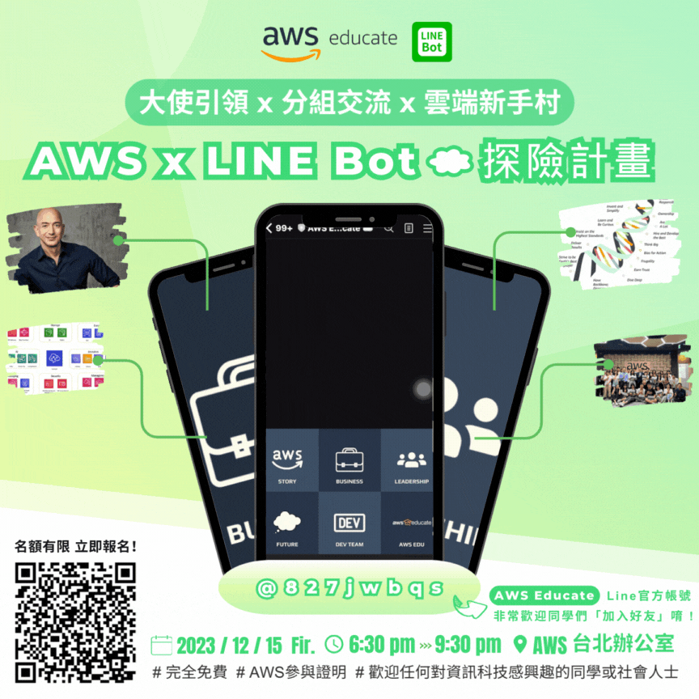

# AWS LINE Business Card

[](https://www.instagram.com/p/C0T-Cu7rpKP/?img_index=1)

## Create `line-bot-sdk` Layer [^1]

```shell
$ mkdir python
$ cd python
$ pip install --target . line-bot-sdk 
$ cd ..
$ zip -r line-bot-sdk.zip ./python
$ rm -rf ./python
```

### With shell script
```shell
$ ./build_line_bot_sdk_layer.sh
```

## Add Permission with s3 [^2]
```js
{
    "Version": "2012-10-17",
    "Statement": [
        {
            "Sid": "PublicReadGetObject",
            "Effect": "Allow",
            "Principal": "*",
            "Action": [
                "s3:GetObject"
            ],
            "Resource": [
                "arn:aws:s3:::your_bucket_name/*"
            ]
        }
    ]
}
```


## CONTACT INFO.

> AWS Educate Cloud Ambassador, Technical Support </br>
> **Hugo ChunHo Lin**
> 
> <aside>
>   📩 E-mail: <a href="mailto:hugo970217@gmail.com">hugo970217@gmail.com</a>
> <br>
>   🧳 Linkedin: <a href="https://www.linkedin.com/in/1chooo/">Hugo ChunHo Lin</a>
> <br>
>   👨🏻‍💻 GitHub: <a href="https://github.com/1chooo">1chooo</a>
>    
> </aside>

## License
Released under [MIT](./LICENSE) by [AWS Educate TW](https://aws.amazon.com/tw/education/awseducate/), [Hugo ChunHo Lin](https://github.com/1chooo).

This software can be modified and reused without restriction.
The original license must be included with any copies of this software.
If a significant portion of the source code is used, please provide a link back to this repository.

[^1]: [使用 .zip 封存檔部署 Python Lambda 函數](https://docs.aws.amazon.com/zh_tw/lambda/latest/dg/python-package.html)
[^2]: [Policies and Permissions in Amazon S3](https://docs.aws.amazon.com/AmazonS3/latest/userguide/access-policy-language-overview.html?icmpid=docs_amazons3_console)

