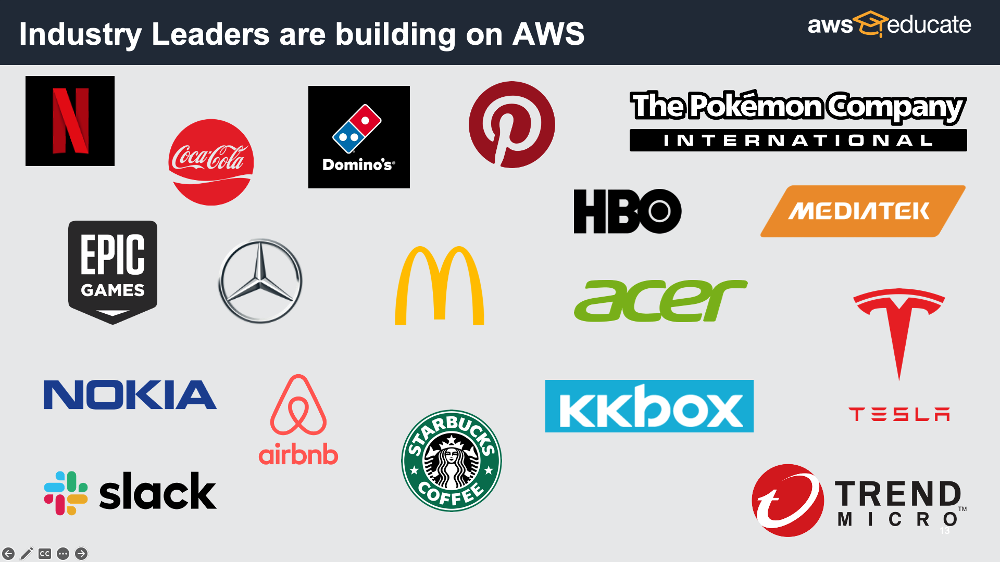

# Hands-On Tips

為公司打造公關形象，打造 line bot 推播公司的資訊。

## Table of Contents
1. 挑選品牌
2. 透過以下主題介紹公司
   - [ ] 設定加入好友訊息
   - [ ] 公司創辦的故事
   - [ ] 公司提供業務
   - [ ] 公司的技術背景
   - [ ] 公司的宗旨
   - [ ] 公司的未來展望
   - [ ] 製作 LINE BOT 的開發團隊
4. 將 line bot 加入 AWS 雲服務

## 挑選品牌
請透過以下與 AWS 有關的品牌，挑選一個你喜歡的品牌，並且會是今天主要推播的品牌。（又或是還有其他興趣並且同樣有使用 AWS 服務的品牌）

#### ☁️ 以下將會以 `AWS` 為例子 ☁️

## 透過以下主題介紹公司

可以透過以下主題來讓使用者了解公司的資訊，並且可以適時地透過照片的輔助來讓使用者更加了解公司的資訊。

1. 公司創辦的故事
2. 公司提供業務
3. 公司的技術背景
4. 公司的宗旨
5. 公司的未來展望
6. 製作 LINE BOT 的開發團隊

並且可以下載此 Excel 模板 [replying_example.xlsx](./replying_example.xlsx) 來進行編輯，以儲存討論的成果。

### 設定加入好友訊息

| 回覆 1 | 回覆 2 | 回覆 3 | 回覆 4 | 回覆 5 |
|:-:|:-:|:-:|:-:|:-:|
| Hi | HiHi | HiHiHi | HiHiHiHi | |

### 公司創辦的故事

| LINE BOT 關鍵字 | 回覆 1 | 回覆 2 | 回覆 3 | 回覆 4 | 回覆 5 |
|:-:|:-:|:-:|:-:|:-:|:-:|
| 我想知道 AWS 創辦故事 | 我想知道 AWS 創辦故事 1 | 我想知道 AWS 創辦故事 2 | 我想知道 AWS 創辦故事 3 | 我想知道 AWS 創辦故事 4 | |

### 公司提供業務

| LINE BOT 關鍵字 | 回覆 1 | 回覆 2 | 回覆 3 | 回覆 4 | 回覆 5 |
|:-:|:-:|:-:|:-:|:-:|:-:|
| 我想知道 AWS 提供的業務 | 我想知道 AWS 提供的業務 1 | 我想知道 AWS 提供的業務 2 | 我想知道 AWS 提供的業務 3 | 我想知道 AWS 提供的業務 4 | |
### 公司的技術背景

| LINE BOT 關鍵字 | 回覆 1 | 回覆 2 | 回覆 3 | 回覆 4 | 回覆 5 |
|:-:|:-:|:-:|:-:|:-:|:-:|
| 我想知道 AWS 技術背景 | 我想知道 AWS 技術背景 1 | 我想知道 AWS 技術背景 2 | 我想知道 AWS 技術背景 3 | 我想知道 AWS 技術背景 4 |  |

### 公司的宗旨

| LINE BOT 關鍵字 | 回覆 1 | 回覆 2 | 回覆 3 | 回覆 4 | 回覆 5 |
|:-:|:-:|:-:|:-:|:-:|:-:|
| 我想知道 AWS 的領導力準則 | 我想知道 AWS 的領導力準則 1 | 我想知道 AWS 的領導力準則 2 | 我想知道 AWS 的領導力準則 3 | 我想知道 AWS 的領導力準則 4 |  |

### 公司的未來展望

| LINE BOT 關鍵字 | 回覆 1 | 回覆 2 | 回覆 3 | 回覆 4 | 回覆 5 |
|:-:|:-:|:-:|:-:|:-:|:-:|
| 我想知道 AWS 未來的發展方向 | 我想知道 AWS 未來的發展方向 1 | 我想知道 AWS 未來的發展方向 2 | 我想知道 AWS 未來的發展方向 3 | 我想知道 AWS 未來的發展方向 4 |  |

### 製作 LINE BOT 的開發團隊

| LINE BOT 關鍵字 | 回覆 1 | 回覆 2 | 回覆 3 | 回覆 4 | 回覆 5 |
|:-:|:-:|:-:|:-:|:-:|:-:|
| 我想了解 AWS LINE BOT 開發團隊 | 我想了解 AWS LINE BOT 開發團隊 1 | 我想了解 AWS LINE BOT 開發團隊 2 | 我想了解 AWS LINE BOT 開發團隊 3 | 我想了解 AWS LINE BOT 開發團隊 4 |  |

## CONTACT INFO.

> AWS Educate Cloud Ambassador, Technical Support  
> **Hugo ChunHo Lin**
> 
> <aside>
>   📩 E-mail: <a href="mailto:hugo970217@gmail.com">hugo970217@gmail.com</a>
>  
>   🧳 Linkedin: <a href="https://www.linkedin.com/in/1chooo/">Hugo ChunHo Lin</a>
>  
>   👨🏻‍💻 GitHub: <a href="https://github.com/1chooo">1chooo</a>
>    
> </aside>

## License
Released under [MIT](./LICENSE) by [AWS Educate TW](https://aws.amazon.com/tw/education/awseducate/), [Hugo ChunHo Lin](https://github.com/1chooo).

This software can be modified and reused without restriction.
The original license must be included with any copies of this software.
If a significant portion of the source code is used, please provide a link back to this repository.