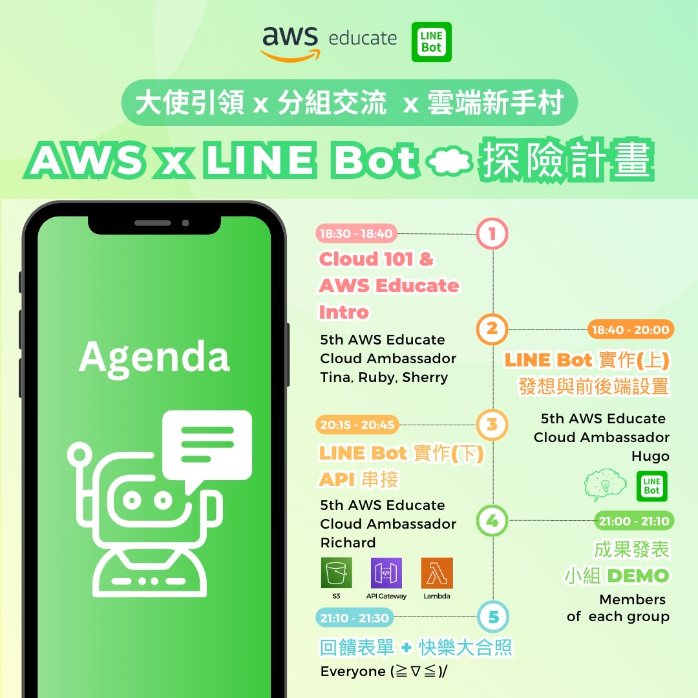
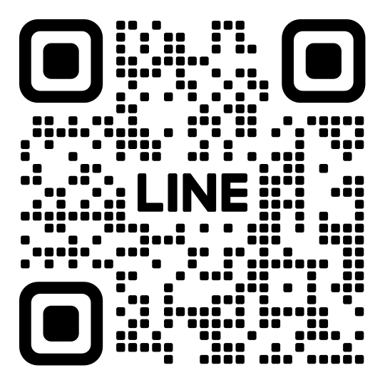
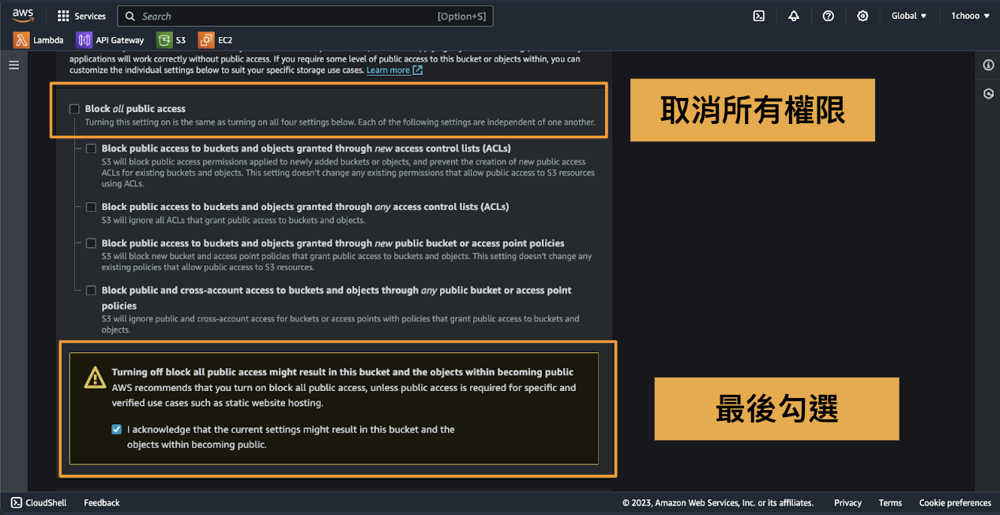
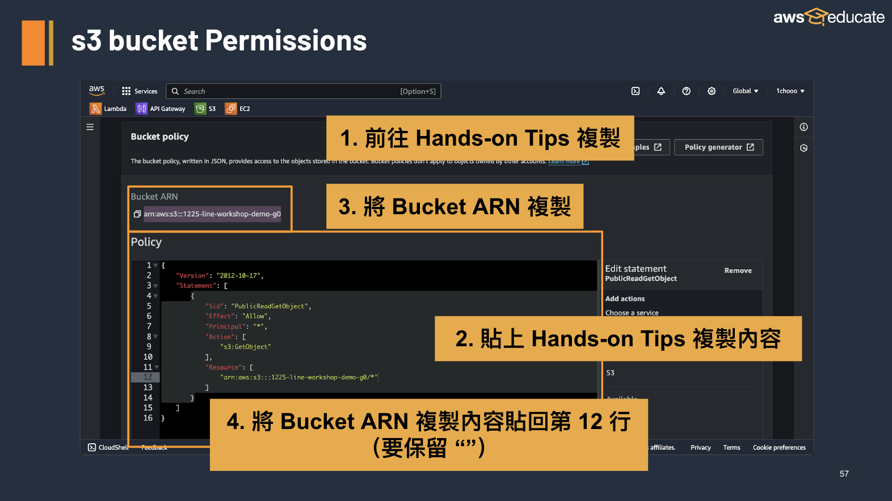

# 2023/12/15 AWS LINE Business Card Workshop Hands-On Tips

12/15 AWS x LINE BOT 雲端探險計畫 ☁︎

| Post | Post | LINE QRCODE |
|:-:|:-:|:-:|
|  |  | 


**Table of Contents**
- [2023/12/15 AWS LINE Business Card Workshop Hands-On Tips](#20231215-aws-line-business-card-workshop-hands-on-tips)
  - [LINE BOT 建立](#line-bot-建立)
    - [挑選品牌](#挑選品牌)
      - [☁️ 以下將會以 `AWS` 為例子 ☁️](#️-以下將會以-aws-為例子-️)
    - [透過以下主題介紹公司](#透過以下主題介紹公司)
      - [設定加入好友訊息](#設定加入好友訊息)
      - [公司創辦的故事](#公司創辦的故事)
      - [公司提供業務](#公司提供業務)
      - [公司的技術背景](#公司的技術背景)
      - [公司的宗旨](#公司的宗旨)
      - [公司的未來展望](#公司的未來展望)
      - [製作 LINE BOT 的開發團隊](#製作-line-bot-的開發團隊)
    - [將回覆照片上傳至 AWS s3](#將回覆照片上傳至-aws-s3)
  - [將 line bot 加入 AWS 雲服務](#將-line-bot-加入-aws-雲服務)
    - [Services](#services)
    - [架構](#架構)
    - [Create Lambda Function](#create-lambda-function)
    - [Edit your Lambda Function](#edit-your-lambda-function)
    - [Upload .zip to Layer](#upload-zip-to-layer)
    - [Add Layer to your Function](#add-layer-to-your-function)
    - [Add Environment variables](#add-environment-variables)
    - [Create API](#create-api)
    - [Webhook Settings](#webhook-settings)
  - [CONTACT INFO.](#contact-info)
  - [License](#license)


## LINE BOT 建立
### 挑選品牌
請透過以下與 AWS 有關的品牌，挑選一個你喜歡的品牌，並且會是今天主要推播的品牌。（又或是還有其他興趣並且同樣有使用 AWS 服務的品牌）


#### ☁️ 以下將會以 `AWS` 為例子 ☁️

### 透過以下主題介紹公司

可以透過以下主題來讓使用者了解公司的資訊，並且可以適時地透過照片的輔助來讓使用者更加了解公司的資訊。

1. 公司創辦的故事
2. 公司提供業務
3. 公司的技術背景
4. 公司的宗旨
5. 公司的未來展望
6. 製作 LINE BOT 的開發團隊

- 可以下載此 Excel 模板 [replying_example.xlsx](./replying_example.xlsx) 來進行編輯，以儲存討論的成果。
- 又或是可以點選以下 [replying_example.xlsx](https://docs.google.com/spreadsheets/d/1QWzJG-QpXdV8y-NSwr-XMEkWmj2djWs0/edit?usp=sharing&ouid=108338307585092515246&rtpof=true&sd=true)，直接進行共同編輯，注意請切換到自己的組別頁面。


#### 設定加入好友訊息

| 回覆 1 | 回覆 2 | 回覆 3 | 回覆 4 | 回覆 5 |
|:-:|:-:|:-:|:-:|:-:|
| 嗨！ {Nickname}您好！👋 我們是第五屆 AWS Educate 校園大使 | {AccountName} 是你的 AWS 小幫手，將帶你探索 Amazon Web Services 的無限可能。 | 將陪你一同踏上雲端運算的冒險之旅。AWS 提供豐富多元的雲端服務，從運算到儲存，應有盡有。 | 我會與你分享 AWS 的最新動態、技術見解，以及 AWS Educate 獨家的學習體驗，讓我們一同迎接科技的挑戰吧！🌟💡 |  |

#### 公司創辦的故事

| LINE BOT 關鍵字 | 回覆 1 | 回覆 2 | 回覆 3 | 回覆 4 | 回覆 5 |
|:-:|:-:|:-:|:-:|:-:|:-:|
| 我想知道 AWS 創辦故事 | AWS ☁️ 的創辦故事始於 2003 年，當時亞馬遜公司的 Jeff Bezos 意識到他們在建設強大的內部基礎設施方面取得了不錯的進展！ | 他認識到這個基礎設施可以成為一個強大的雲端運算平台，能夠為其他企業提供服務。於是在 2006 年，AWS ☁️ 正式推出，開始提供雲端服務。 |  | AWS ☁️ 的成功與其開放性、靈活性和不斷創新的企業文化有關。 | 這一切都源於 Jeff Bezos 對技術和未來的敏銳洞察力✨，他能看到潛在的機會並推動公司朝著新的方向發展。 |

```python
elif event_text == "你們的關鍵字":
	reply_messages = [
		TextSendMessage(
			text=f'我想知道 AWS 創辦故事 1'
		),
		TextSendMessage(
			text=f'我想知道 AWS 創辦故事 2'
		),
		TextSendMessage(
			text=f'我想知道 AWS 創辦故事 3'
		),
		TextSendMessage(
			text=f'我想知道 AWS 創辦故事 4'
		),
		ImageSendMessage(
			original_content_url = "https://line-workshop-test.s3.amazonaws.com/01_story.png",
			preview_image_url = "https://line-workshop-test.s3.amazonaws.com/01_story.png",
		),  # 圖片訊息可以更換順序，也可以多張圖片
	]

    line_bot_api.reply_message(
    	event.reply_token,
    	reply_messages
    )
```

#### 公司提供業務

| LINE BOT 關鍵字 | 回覆 1 | 回覆 2 | 回覆 3 | 回覆 4 | 回覆 5 |
|:-:|:-:|:-:|:-:|:-:|:-:|
| 我想知道 AWS 提供的業務 | AWS ☁️ 提供多樣化的雲端運算服務，包括計算（如 EC2 與 Lambda）、儲存（如 S3）、資料庫（如 RDS）、機器學習、人工智慧、物聯網、區塊鏈等。 | 舉例來說，EC2 提供虛擬伺服器，Lambda 則提供無需管理伺服器的程式碼執行環境。同時，S3 提供無限儲存空間，RDS 提供受管理的資料庫服務。API Gateway 可建立、部署和管理安全的 API，讓您輕鬆構建和監控應用程式介面。 |  | AWS ☁️ 致力於為客戶提供完整、可擴展且高度安全的雲端解決方案。 | 且 AWS ☁️ 的多樣性和高度可靠性確保您可以找到符合您業務需求的解決方案。 |

```python
elif event_text == "我想知道 AWS 提供的業務":
    reply_messages = [
        TextSendMessage(
            text=f'我想知道 AWS 提供的業務 1'
        ),
        TextSendMessage(
            text=f'我想知道 AWS 提供的業務 2'
        ),
        TextSendMessage(
            text=f'我想知道 AWS 提供的業務 3'
        ),
        TextSendMessage(
            text=f'我想知道 AWS 提供的業務 4'
        ),
        ImageSendMessage(
            original_content_url = "https://line-workshop-test.s3.amazonaws.com/02_business.png",
            preview_image_url = "https://line-workshop-test.s3.amazonaws.com/02_business.png",
        ),
    ]

    line_bot_api.reply_message(
        event.reply_token,
        reply_messages
    )
```

#### 公司的技術背景

| LINE BOT 關鍵字 | 回覆 1 | 回覆 2 | 回覆 3 | 回覆 4 | 回覆 5 |
|:-:|:-:|:-:|:-:|:-:|:-:|
| 我想知道 AWS 技術背景 | 我想知道 AWS 技術背景 1 | 我想知道 AWS 技術背景 2 | 我想知道 AWS 技術背景 3 | 我想知道 AWS 技術背景 4 | https://line-workshop-test.s3.amazonaws.com/03_tech.png |

```python
elif event_text == "我想知道 AWS 技術背景":
    reply_messages = [
        TextSendMessage(
            text=f'我想知道 AWS 技術背景 1'
        ),
        TextSendMessage(
            text=f'我想知道 AWS 技術背景 2'
        ),
        TextSendMessage(
            text=f'我想知道 AWS 技術背景 3'
        ),
        TextSendMessage(
            text=f'我想知道 AWS 技術背景 4'
        ),
        ImageSendMessage(
            original_content_url = "https://line-workshop-test.s3.amazonaws.com/03_tech.png",
            preview_image_url = "https://line-workshop-test.s3.amazonaws.com/03_tech.png",
        ),
    ]

    line_bot_api.reply_message(
        event.reply_token,
        reply_messages
    )
```

#### 公司的宗旨

| LINE BOT 關鍵字 | 回覆 1 | 回覆 2 | 回覆 3 | 回覆 4 | 回覆 5 |
|:-:|:-:|:-:|:-:|:-:|:-:|
| 我想知道 AWS 的16項領導力準則 | AWS ☁️ 的 16 項領導力準則是文化核心價值觀的體現，著重於滿足客戶需求並超越期望，以及追求卓越而非滿足現狀。 |  | 同時，這些準則強調了團隊合作、創新、效率和對變革的開放態度，成為公司文化中的重要支柱。 | 透過這些準則，AWS ☁️ 激勵著員工發揮最佳表現，持續挑戰自我，並不斷追求個人與團隊的成長。 | 這些準則不僅是指導方針，更是推動公司進步和持續發展的動力所在。 |

```python
elif event_text == "我想知道 AWS 的領導力準則":
    reply_messages = [
        TextSendMessage(
            text=f'我想知道 AWS 的領導力準則 1'
        ),
        TextSendMessage(
            text=f'我想知道 AWS 的領導力準則 2'
        ),
        TextSendMessage(
            text=f'我想知道 AWS 的領導力準則 3'
        ),
        TextSendMessage(
            text=f'我想知道 AWS 的領導力準則 4'
        ),
        ImageSendMessage(
            original_content_url = "https://line-workshop-test.s3.amazonaws.com/04_leadership.png",
            preview_image_url = "https://line-workshop-test.s3.amazonaws.com/04_leadership.png",
        ),
    ]

    line_bot_api.reply_message(
        event.reply_token,
        reply_messages
    )
```

#### 公司的未來展望

| LINE BOT 關鍵字 | 回覆 1 | 回覆 2 | 回覆 3 | 回覆 4 | 回覆 5 |
|:-:|:-:|:-:|:-:|:-:|:-:|
| 我想知道 AWS 未來的發展方向 | AWS ☁️ 將持續引領雲端運算發展，擴展服務和解決方案以滿足客戶需求。 | 未來將深入研究人工智慧、機器學習等，提供更智能、靈活的解決方案。 | AWS ☁️ 致力於提升雲端基礎設施性能和安全性，保障客戶資料安全。 | AWS ☁️ 積極推動環保和可持續發展，尋求綠色能源方案與客戶攜手實現可持續目標 |  |

```python
elif event_text == "我想知道 AWS 未來的發展方向":
    reply_messages = [
        TextSendMessage(
            text=f'我想知道 AWS 未來的發展方向 1'
        ),
        TextSendMessage(
            text=f'我想知道 AWS 未來的發展方向 2'
        ),
        TextSendMessage(
            text=f'我想知道 AWS 未來的發展方向 3'
        ),
        TextSendMessage(
            text=f'我想知道 AWS 未來的發展方向 4'
        ),
        ImageSendMessage(
            original_content_url = "https://line-workshop-test.s3.amazonaws.com/05_future.png",
            preview_image_url = "https://line-workshop-test.s3.amazonaws.com/05_future.png",
        ),
    ]

    line_bot_api.reply_message(
        event.reply_token,
        reply_messages
    )
```

#### 製作 LINE BOT 的開發團隊

| LINE BOT 關鍵字 | 回覆 1 | 回覆 2 | 回覆 3 | 回覆 4 | 回覆 5 |
|:-:|:-:|:-:|:-:|:-:|:-:|
| 我想了解 AWS LINE BOT 開發團隊 | 嗨！👋 \n我們是第五屆 AWS Educate 校園大使 | 我是你的 AWS 小幫手，將帶你探索 Amazon Web Services 的無限可能。 | 將陪你一同踏上雲端運算的冒險之旅。AWS 提供豐富多元的雲端服務，從運算到儲存，應有盡有。 | 我會與你分享 AWS 的最新動態、技術見解，以及 AWS Educate 獨家的學習體驗，讓我們一同迎接科技的挑戰吧！🌟💡 |  |

```python
elif event_text == "我想了解 AWS LINE BOT 開發團隊":
    reply_messages = [
        TextSendMessage(
            text=f'我想了解 AWS LINE BOT 開發團隊 1'
        ),
        TextSendMessage(
            text=f'我想了解 AWS LINE BOT 開發團隊 2'
        ),
        TextSendMessage(
            text=f'我想了解 AWS LINE BOT 開發團隊 3'
        ),
        TextSendMessage(
            text=f'我想了解 AWS LINE BOT 開發團隊 4'
        ),
        ImageSendMessage(
            original_content_url = "https://line-workshop-test.s3.amazonaws.com/06_developing.png",
            preview_image_url = "https://line-workshop-test.s3.amazonaws.com/06_developing.png",
        ),
    ]

    line_bot_api.reply_message(
        event.reply_token,
        reply_messages
    )
```

### 將回覆照片上傳至 AWS s3

取消所有權限以讓所有人都可以讀取，並且將以下內容貼到 Bucket Policy 中。





```js
{
    "Version": "2012-10-17",
    "Statement": [
        {
            "Sid": "PublicReadGetObject",
            "Effect": "Allow",
            "Principal": "*",
            "Action": [
                "s3:GetObject"
            ],
            "Resource": [
                "arn:aws:s3:::your_bucket_name/*"   // Change into your bucket name
            ]
        }
    ]
}
```


## 將 line bot 加入 AWS 雲服務
### Services
- [API Gateway](https://aws.amazon.com/tw/api-gateway/)：用來溝通Line和Lambda
- [Lambda](https://aws.amazon.com/tw/lambda/)：用來傳送名片訊息
- [S3](https://aws.amazon.com/tw/s3/)：用來儲存檔案 ex: image or txt

### 架構
- webhook：一種即時通知的機制，會在特定情況下觸發，呼叫一串叫做API的網址。在本次工作坊是Line Bot收到任何訊息的情況下，之後呼叫剛剛說的API。
- API：是一個允許應用程式之間通訊的橋樑，負責傳送和回應訊息。在本次工作坊會由Webhook呼叫，並將Line收到的訊息傳送給Lambda處理。
- Lambda：一個只用於執行程式的伺服器，會在事件發生時執行我們設定的函式Function。在本次工作坊的事件是API被呼叫的時候，會執行發送名片訊息的程式，回傳給LINE。

### Create Lambda Function
Enter Lambda Console:  
1. Choose **[Functions](https://console.aws.amazon.com/lambda/home#/functions)**
2. Click **Creates fcunction**
3. Type **Function name** whatever you want
4. Select **Python 3.9**
5. Click Create function

### Edit your Lambda Function
After you create Lambda Function successfully, you need to paste you code.  
1. Scroll down and paset your code in code source.
2. Click **Test**
3. Customize your **Event name**
4. Click **Save**
5. Click **Deploy**
6. After successful deployment, click **Test**  
You will see some errors because we lost some libraries.
To inform Lambda about the required modules, we need to upload the .zip file to the layer.

### Upload .zip to Layer
1. Open **Menu**
2. Click **Layers**
3. Click **Create layer**
4. Type **Name** and  download the [line-bot-sdk.zip](https://raw.githubusercontent.com/1chooo/aws-line-business-card/main/line-bot-sdk.zip) to upload to layer
   , Choose **x86_64**
   , Select **Python 3.9**
5. Click **Create**

### Add Layer to your Function
Back to your Lambda Function and scroll down to find the Layers
1. Click **Add a layer** from Layers
2. Select **Custom layers**
3. Choose the layer you just created
4. Click **Add**  
After layer is added, you can try Test again, but it will pop new error.
Because the lambda can't find the **Line Bot KEY**, so we need to add **Environment variables**

### Add Environment variables
1. **Configuration**
2. **Environment variables**
3. **Edit**
4. Click **Add Environment variable** two times, and input **CHANNEL_ACCESS_TOKEN** and **CHANNEL_SECRET** seperately  
Now, we need to go back to the [Line Developers console](https://developers.line.biz/console/) to obtain the these two KEY.
Choose your Line Bot just created, and find the CHANNEL_ACCESS_TOKEN in **Messaging API** and CHANNEL_SECRET in **Basic settings**  
5. Select **Messaging API** and scroll to the bottom. Issue the **Channel access token** and copy this to the **CHANNEL_ACCESS_TOKEN**
6. Select **Basic settings** and scroll to the bottom. Copy **Channel secret** to the **CHANNEL_SECRET**
7. Back to Lambda and **Save**  
You can test again, but you will encounter another error. This is because the request is not originating from Line. When making requests to this program, we check whether the message is coming from Line to avoid malicious requests.
So, now we need to use API Gateway to create an API that receives the correct requests from Line.

### Create API
Enter **[API Gateway](https://console.aws.amazon.com/apigateway)** Console:  
1. Find the **REST API** and click **Build**
2. Customize your **API name** and click **Create API**
3. Click **Create method** in Methods
4. Select Method type with **POST**
5. Switch on the **Lambda proxy integration**
6. Choose your **Lambda Function**
7. **Create method**
8. Click **Deploy API**
9. Select **New stage** and type **prod** to stage name
10. Deploy
11. After API is deployed, copy the **Invoke URL**  
This URL is the Webhook URL, so we need to paste it into the Line Bot settings.

### Webhook Settings
Go to Line Developers Console and choose your Line Bot's Messeging API  
1. Scroll down to find the **Webhook settings**, and click **Edit** to paste the **Invoke URL**
2. Switch on **Use webhook**
3. Click **Verify** and check for **Success**

## CONTACT INFO.

> AWS Educate Cloud Ambassador, Technical Support </br>
> 
> **Hugo ChunHo Lin**
> 
> <aside>
>   📩 E-mail: <a href="mailto:hugo970217@gmail.com">hugo970217@gmail.com</a>
> <br>
>   🧳 Linkedin: <a href="https://www.linkedin.com/in/1chooo/">Hugo ChunHo Lin</a>
> <br>
>   👨🏻‍💻 GitHub: <a href="https://github.com/1chooo">1chooo</a>
>    
> </aside>
> 
> <br>
> 
> **Richard**
> 
> <aside>
>   📩 E-mail: <a href="mailto:Drahcir.lsc@gmail.com">Drahcir.lsc@gmail.com</a>
> <br>
>   🧳 Linkedin: <a href="https://www.linkedin.com/in/resultcheng/">Shao Cheng Lu</a>
> <br>
>   👨🏻‍💻 GitHub: <a href="https://github.com/IdONTKnowCHEK">IdONTKnowCHEK</a>
>    
> </aside>

## License
Released under [MIT](./LICENSE) by [AWS Educate TW](https://aws.amazon.com/tw/education/awseducate/), [Hugo ChunHo Lin](https://github.com/1chooo).

This software can be modified and reused without restriction.
The original license must be included with any copies of this software.
If a significant portion of the source code is used, please provide a link back to this repository.
